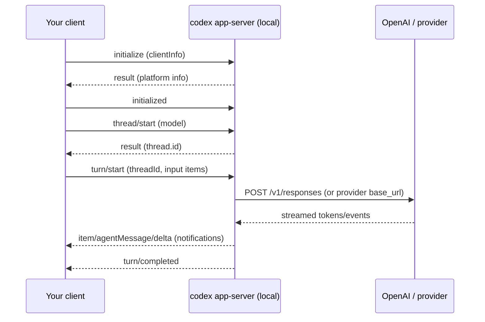

# Codex CLI 斜杠命令是否存在对应的公共 API 或分发二进制文件：深度研究报告

## 执行摘要

本次检索覆盖了“Codex CLI / codex”相关的主要实现与分发渠道，并对“斜杠命令（Slash Commands）是否有对应的公共 API 或分发二进制文件”给出结论：**有分发二进制文件；斜杠命令本身不是“远端公开 API”，而是客户端（本地）命令系统的一部分；它们触发的网络调用主要走公开的 OpenAI Responses API（以及少量看起来是 ChatGPT 后端或特权端点的私有/受限接口），因此不宜把斜杠命令当作有稳定、可依赖的“远端 slash-commands API”来集成。** citeturn21search2turn9view1turn20view1turn18view0turn16view0

更具体地说：

- **分发层面**：官方存在多渠道分发（GitHub Releases、多平台压缩包/安装器并附 SHA256；Homebrew Cask JSON 直给下载 URL 与 SHA256；npm 全局安装入口）。citeturn9view1turn24view1turn6search18turn23search2  
- **实现层面**：斜杠命令在开源仓库中有明确实现（Rust 终端 UI 模块中定义枚举、描述、可用性 gating、模糊匹配等）。citeturn13view0turn15view0  
- **“公共 API”层面**：  
  - 存在**官方文档化、可用于深度集成的本地协议**：`codex app-server`（JSON-RPC 2.0，stdio/WebSocket）以及 **Codex SDK**；它们更接近“公共 API”概念，但它们是**本地/集成协议**，不是远端 HTTP“slash commands API”。citeturn7view0turn4view1turn28view1  
  - 斜杠命令触发的远端网络请求，主干是 **OpenAI Responses API**（`POST /v1/responses`、`GET /v1/models` 等公开接口）；但也能观察到 **ChatGPT 后端域名**（如 `chatgpt.com/backend-api/codex/responses`）以及 **可能受限的端点**（如 `POST /v1/responses/compact` 报错提示“必须用浏览器 session key”），这些不构成稳定公共 API。citeturn16view2turn20view1turn18view0turn16view0  

结论落地建议：如果你的目标是“集成/自动化/复用 slash 命令能力”，**优先走 `codex app-server` 或 Codex SDK**；如果目标是“复刻网络调用”，可对接公开 Responses API，但**不要依赖 `chatgpt.com/backend-api/*` 或 `/v1/responses/compact` 之类的受限接口**。citeturn7view0turn20view1turn16view0

## 研究范围与证据标准

本报告按你提出的六类证据组织：官方文档、可观测网络端点、二进制/模块实现、开源与包管理器、issue/社区痕迹、以及许可与使用约束。由于“codex”一词在不同生态中可能重名，本次检索以 **OpenAI 官方 Codex CLI** 作为主锚点，同时进行了中文与泛搜索补充；但在“带斜杠命令的 codex CLI”这一具体特征上，开源与官方文档均指向同一项目为绝对主流。citeturn21search2turn29view1turn23search2turn22search1

## 官方文档与斜杠命令入口点

官方开发者文档明确描述了 Codex CLI、其斜杠命令的用途与交互入口：在 composer 中输入 `/` 打开命令弹窗，执行切模型、调权限、压缩上下文等操作。citeturn21search2turn29view1

### 内置斜杠命令目录与行为

官方“Slash commands in Codex CLI”页面给出内置命令列表，并明确一些命令用途，例如 `/permissions`、`/agent`、`/apps`、`/status` 等；还描述了 `/model` 的交互式选择流程（选择模型、验证状态）。citeturn29view1

为了把“文档声明”与“代码实现”对齐，本次还核对了开源实现中的命令枚举与描述（见后文“本地实现”）。两者整体一致：斜杠命令由客户端维护一套命令表，并在 UI 中提供可发现的选择器与模糊匹配。citeturn13view0turn15view0turn29view1

### 自定义斜杠命令与命令扩展点

官方文档把“自定义 prompts”作为可分发/可复用的命令扩展机制：  
- 通过在 `~/.codex/prompts/` 下放置 Markdown 文件，引入自定义命令；在菜单中通过 `/prompts:<name>` 触发；支持位置参数 `$1..$9`、`$ARGUMENTS` 以及大写命名参数占位符（如 `$FILE`、`$TICKET_ID`）。citeturn30view0  
- 文档同时强调需要重启会话以重新加载 prompt 文件，并说明扫描范围（只扫描顶层 Markdown 文件，不支持子目录）。citeturn30view0

这意味着：**斜杠命令体系存在明确“本地文件扩展点”**，而不是依赖一个远端的“注册 slash command API”。citeturn30view0turn20view0

### 配置与状态位置（命令生态的落盘形态）

官方高级配置文档明确：Codex 的本地状态位于 `CODEX_HOME`（默认 `~/.codex`），常见文件包含 `config.toml`、`auth.json`、历史与日志等；并支持用 `openai_base_url` 改写内置 OpenAI provider 的 base URL。citeturn20view0

这对“斜杠命令是否需要远端公开 API”有关键含义：命令动作至少有一部分是**本地状态变更**（如模型、权限、特性开关），其权威来源就是本地配置与当前会话状态。citeturn20view0turn13view0turn29view1

## 远端 API 端点与鉴权方式：哪些是“公共 API”，哪些更像内部接口

你关心“slash commands 是否调用远端 API、URL/格式/鉴权是什么”。从证据强度看，本次可以把观察到的网络面分为三层：**公开 OpenAI API**、**ChatGPT 后端/会话型接口**、**疑似受限/特权端点**。

### 公开且可用的主干：OpenAI Responses API 与 Models API

多个问题报告与官方 API 文档共同表明：Codex（至少在 API key 模式下）会请求 `https://api.openai.com/v1/responses`，并且通常也会请求 `https://api.openai.com/v1/models` 来刷新模型列表。citeturn16view2turn17search5turn20view1

官方 API Reference 指明 `POST /responses`（即 `/v1/responses`）的请求体结构与 `Authorization: Bearer <API_KEY>` 的常见使用方式，并定义了 `input` 的多种形态（string 或 items 列表）。citeturn20view1turn19search22

> 关键判断：**斜杠命令并不对应一个独立“/slash-commands”远端 REST API。**它们更多是改变本地会话状态或触发某类工作流，而“让模型干活”的网络调用仍然落在通用的 `responses` 端点上。citeturn13view0turn20view1turn29view1

### ChatGPT 账户登录路径下可观测到的 ChatGPT 后端域名

多个 issue 直接在错误日志中显示 Codex 请求 `https://chatgpt.com/backend-api/codex/responses`，并在网络断开等情况下对该 URL 进行重试。citeturn18view0turn18view1

这与“ChatGPT 账户登录”模式一致：Codex CLI/相关客户端可以用 ChatGPT 订阅登录，而不是纯 API key；帮助中心文档明确“用 ChatGPT 账号连接 Codex”并覆盖 CLI、IDE extension、web、app 等入口。citeturn28view1turn21search2

> 风险判断：`chatgpt.com/backend-api/codex/responses` **不是公开开发者 API 文档的一部分**，更像 ChatGPT 产品后端接口。对外集成不应依赖它的稳定性、可用性或许可范围。citeturn18view0turn31view0turn28view1

### 受限或疑似特权接口：`/v1/responses/compact` 与“必须浏览器 session key”

在 `/compact` 相关 bug 报告中，错误信息明确指出：对 `POST /v1/responses/compact` 的请求“必须使用 session key（只能从浏览器发起）”，并给出 `missing_scope`。citeturn16view0

这类提示强烈表明：  
- 该端点要么是 **ChatGPT/web 侧专用**，要么是 **需要特定 OAuth scope / session key** 的特权能力；  
- 它不构成可供第三方稳定使用的公开 API（即便路径长得像公开 API）。citeturn16view0turn31view0turn20view1

同时，公开 Responses API 已经提供了与上下文管理相关的参数（例如 `context_management` 中的 “compaction” 类型配置），这为“不要碰受限端点、而用公开能力实现压缩策略”提供了替代路径。citeturn20view1

### 鉴权：OAuth token exchange 与 API key

在 ChatGPT 登录流程相关 issue 中，CLI 在 token 交换阶段访问 `https://auth.openai.com/oauth/token`；失败时会按原样报出该 URL。citeturn16view2turn17search18

在 API key 模式下，典型调用是 `https://api.openai.com/v1/responses`（并配合 `Authorization: Bearer <OPENAI_API_KEY>`）；一些用户会用 curl 验证该端点可用。citeturn17search25turn19search22turn20view1

官方 Authentication 文档也明确了“使用 ChatGPT 计划登录”与“使用 OpenAI API key”的两种路径，并提示 credential storage（keyring/file）与远程环境风险（不要在不受信任环境暴露 Codex 执行）。citeturn3search0turn20view0

## 本地二进制与模块实现：斜杠命令“在本地哪里实现、怎么分发、能否验真”

你要求“文件名、路径、校验和、版本”。这一部分证据最硬：开源仓库与发布资产直接给出实现位置与 SHA256。

### 斜杠命令的开源实现位置

在开源仓库中，斜杠命令的核心实现至少包含：

- `codex-rs/tui/src/slash_command.rs`：定义 `SlashCommand` 枚举，给出用户可见描述、命令字符串、是否支持 inline args、任务中是否可用、可见性（按 OS / debug gating）等；还能看到具体命令条目（如 `Compact`、`Review`、`Model`、`Permissions`、`Apps`、`Mcp`、`Fast`、`Personality` 等）。citeturn13view0  
- `codex-rs/tui/src/bottom_pane/slash_commands.rs`：抽出“可用命令过滤与模糊匹配”的共享逻辑，按 flags（connectors、plugins、fast、realtime 等特性开关）决定哪些命令出现在弹窗中，以及 fuzzy match 行为。citeturn15view0  
- 设计文档 `docs/tui-chat-composer.md` 明确：built-in slash command availability 被集中在上述 `bottom_pane/slash_commands.rs`，并被 composer 与 popup 复用以保持 gating 一致。citeturn13view1

> 结论：斜杠命令在 Codex CLI 中是**第一方本地功能**，并非“远端 API 的薄壳”。其命令表、UI 行为与 gating 逻辑在本地（Rust）代码中清晰可审计。citeturn13view0turn15view0turn13view1

### GitHub Releases：多平台可执行文件与 SHA256

GitHub Releases 页面展示了 `codex-*` 多平台资产，并为每个资产标注 SHA256。例如同一发布中可见：  
- `codex-aarch64-apple-darwin.dmg`、`codex-aarch64-apple-darwin.tar.gz`、`codex-aarch64-apple-darwin.zst`、`codex-aarch64-pc-windows-msvc.exe` 等，并直接列出对应 SHA256。citeturn9view0turn9view1  

这满足“分发二进制 + 校验和”的强证据需求：你可以对下载产物进行可重复校验并锁定版本。citeturn9view1

### Homebrew Cask：官方分发元数据（URL + SHA256 + 变体）

Homebrew 的 cask JSON API 对 `codex` 给出：  
- 当前版本号、下载 URL（指向 openai/codex Releases）、以及 SHA256；  
- 针对不同平台/系统版本的 variations（含 Intel mac、x86_64_linux、arm64_linux 等下载 URL 与 SHA256）；  
- 安装产物映射（例如将 `codex-aarch64-apple-darwin` 安装为 `codex` 可执行文件），以及卸载清理（zap `~/.codex`）。citeturn24view1turn24view0

这是“分发二进制是否存在、是否可被外部复用”的另一层独立证据：Homebrew 不只是“安装脚本”，而是把版本、来源、hash 以机器可读方式公开。citeturn24view1

### npm 安装路径与“后置下载”机制线索

虽然 npm registry 页面在本环境中返回 403（无法直接抓取包页面），但 Codex 仓库 issue 与 CI 工作流痕迹明确讨论了 npm 包体积与二进制打包策略：  
- 有提案把 npm 包从“包含所有平台二进制”改为“postinstall 按平台从 GitHub Releases 下载需要的二进制”。citeturn27search0  
- 还有与 npm 安装失败相关的日志指出依赖项（如 ripgrep 预编译包）在 postinstall 阶段会触发对 GitHub Releases 的请求并在 403/rate limit 情况下失败，这从侧面证明 npm 安装链路中确实存在“安装期下载行为”。citeturn27search5turn27search7  
- CI workflow 片段显示存在“Stage npm package”的打包步骤（脚本 `scripts/stage_npm_packages.py`、指定 `CODEX_VERSION`、产出 `codex-npm-<version>.tgz`）。citeturn27search13

> 结论：npm 渠道更像“引导器/包装器”，最终仍以 Releases 的平台二进制为核心分发单元。citeturn27search0turn9view1

## 对比表：来源、仓库、API、二进制与稳定性判断

下面两张表分别回答“斜杠命令与 API/协议的关系”和“二进制分发/校验”。

### 斜杠命令相关的“可集成接口”对比

| 接口/入口 | 类型 | 是否官方文档化 | 主要用途 | 与斜杠命令关系 | 稳定性/风险判断 |
|---|---|---|---|---|---|
| 斜杠命令（`/model`、`/permissions`、`/compact` 等） | 本地交互功能 | 是（CLI Slash commands 指南）citeturn29view1 | 会话控制、工作流快捷入口 | 本体就是“本地命令系统” | 取决于 CLI 版本；命令表在本地实现，可审计citeturn13view0turn15view0 |
| 自定义 prompts（`/prompts:<name>`） | 本地扩展机制（文件） | 是（Custom prompts 文档）citeturn30view0 | 团队/个人命令扩展 | 通过文件扩展 slash 菜单 | 稳定性依赖 CLI 扫描逻辑；官方明确扫描位置与限制citeturn30view0turn20view0 |
| `codex app-server` | 本地协议（JSON-RPC over stdio/ws） | 是（App Server 文档）citeturn7view0 | IDE/产品深度集成：鉴权、历史、审批、事件流 | 可用来“程序化驱动”类似 slash 的会话控制（更底层） | 文档明确 ws 模式“实验性”、可能变化；但协议是官方推荐集成点citeturn7view0 |
| Codex SDK（TS） | 本地库（封装 CLI I/O） | 是（SDK 文档与仓库）citeturn4view1turn7view0 | 自动化/CI 场景驱动 Codex | 替代“在终端敲 slash”以实现程序化控制 | 目标是稳定对外；但本质仍依赖本地 codex 二进制citeturn4view1turn7view0 |
| OpenAI Responses API（`POST /v1/responses`） | 远端公开 HTTP API | 是（API Reference）citeturn20view1turn19search22 | 模型推理、工具调用、上下文管理 | slash 命令背后“让模型干活”的主干接口之一 | 公共 API；适合集成 |
| ChatGPT 后端（`chatgpt.com/backend-api/codex/responses`） | 远端（产品后端） | 否（仅在 issue/日志出现）citeturn18view0turn18view1 | ChatGPT 登录模式下的 Codex 调用 | 可能由某些会话/命令触发 | 高风险：非公开文档；不建议集成依赖citeturn31view0turn18view0 |
| `/v1/responses/compact` | 远端端点（疑似受限） | 否（仅在报错中出现）citeturn16view0 | 远端“compact”任务 | 与 `/compact` 行为高度相关 | 报错指向“仅浏览器 session key”；不应视为公共 APIciteturn16view0turn31view0 |

### 二进制与包管理器对比

| 渠道 | 证据点 | 版本/资产示例 | SHA256 证据 | 备注 |
|---|---|---|---|---|
| GitHub Releases | Releases 资产列表含 SHA256 | `codex-aarch64-apple-darwin.tar.gz`、Windows `.exe` 等citeturn9view1 | 资产旁直接列出 sha256citeturn9view1 | 最直接的“下载 + 校验”来源 |
| Homebrew Cask | cask JSON API 提供 url+sha256 | `codex` cask 指向 Releases 下载citeturn24view1turn24view0 | JSON 中 `sha256` 字段与 variationsciteturn24view1 | 机器可读；可用于企业镜像/锁版本 |
| npm 全局安装入口 | 官方 quickstart/仓库 README 都给出命令 | `npm install -g @openai/codex`citeturn6search18turn23search2 | 需以 Releases hash 或本地计算为准 | issue 暗示 postinstall/安装期下载行为citeturn27search0turn27search5 |

## 来自 issue、网络痕迹与社区文章的实现线索

本段只保留能直接回答“API/实现/分发”的高载荷线索。

### `/review`、`/model`、`/compact` 等命令触发的“非统一行为”迹象

存在 issue 指出：特定 slash 命令（例如 `/review`）可能不完全遵循配置的模型/端点设置（例如忽略自定义 provider/endpoint），这从侧面证明 slash 命令并非简单“把当前 prompt 送到同一个 /v1/responses”，而可能走独立工作流或单独的模型选择逻辑。citeturn19search24

对“企业网络放行域名/端点清单”的需求也出现在仓库 issue 中：用户只知道一般走 `api.openai.com`，但希望官方给出更完整域名列表（提到 `mtls.api.openai.com` 等作为例子）。这说明实际网络面可能比文档显式提到的更多，且官方未必提供固定清单。citeturn16view1

### 中国语境资料：对本地扩展点的复述与普及

中文社区与博客对 `~/.codex/prompts/` 自定义斜杠命令的路径、重启生效等要点有复述（例如知乎文章提到 `/init`、`~/.codex/prompts/`）。这类资料对“怎么用”有帮助，但**不应作为 API/许可判断依据**，仍以官方文档与源码为准。citeturn22search1turn30view0turn13view0

## 法律、使用约束与许可边界

这部分必须直说：你提到“reverse-engineering”，但不同对象的许可边界完全不同。

### 软件本体开源许可

OpenAI 的 Codex 仓库 LICENSE 明确是 **Apache License 2.0**。citeturn29view2  
这意味着：对**仓库中开源代码**的阅读、修改、再分发等，遵循 Apache-2.0 的条款即可（保留版权声明、NOTICE 等）。citeturn29view2

### 对服务端/模型/系统的“禁止逆向”条款

但你如果把“reverse-engineering”指向 **OpenAI 在线服务/模型/系统**（包括 ChatGPT、Codex 云端能力或其他服务端组件），OpenAI Terms of Use 的“禁止行为”明确包含：不得尝试或协助逆向、反编译或发现服务源代码/底层组件（包括模型、算法、系统），且不得绕过限制或防护措施。citeturn31view0

此外，帮助中心与安全/配置文档也强调了权限、审批、沙箱等控制面，并提示不要在不受信任环境暴露 Codex 执行（这属于安全合规约束，而不仅是技术问题）。citeturn20view0turn28view1

> 实操含义：你可以在 Apache-2.0 范围内**研究开源 CLI 如何解析/分发 slash commands**；但如果目标是**抓取/复刻私有后端端点**（例如 `chatgpt.com/backend-api/codex/responses` 或被提示需要 session key 的 `/v1/responses/compact`），这既存在稳定性风险，也可能触及条款边界。citeturn18view0turn16view0turn31view0

## 推荐的下一步：集成路线与“合规的可观测/验证”路线

你要的是“能集成或能拆解”。下面分成两条路线：**集成优先**与**验证/观测优先**。我会给出尽量可执行的命令/示例，并避免引导你去绕过限制。

### 集成优先路线

如果你的目标是把“slash commands 能做的事”编程化，而不是照搬 UI：

**优先选 `codex app-server` 作为“公共 API”替代物。**它是 Codex 用来驱动富客户端（例如 VS Code 扩展）的接口，协议是 JSON-RPC 2.0，支持 stdio JSONL 与实验性的 WebSocket，并且提供 schema 生成命令。citeturn7view0

这条路线的价值在于：  
- 你不需要“模拟输入 `/model`”；你可以通过 app-server 方法直接驱动 thread/turn 生命周期、监听事件流、接入审批与历史等。citeturn7view0  
- 你能把集成边界固定在“本地 codex app-server 协议”，而不是某个未文档化的远端 endpoint。citeturn7view0turn31view0

同时，**Codex SDK（TS）** 被官方建议用于自动化/CI 场景，比 app-server 更偏“脚本化运行 Codex”。citeturn7view0turn28view1

下面给出官方文档同款的 app-server 最小调用流（示意），你可以据此扩展成自己的客户端：



该流程中的 `initialize`、`thread/start`、`turn/start` 等方法名、参数结构与 stdio JSONL 传输，在官方 app-server 文档中均有明确示例。citeturn7view0

### 公开 HTTP API 路线（只走 Responses API）

如果你不想引入 Codex CLI，而是要“把某些 slash workflows 转成纯 API 调用”，那就直接用 **Responses API**，并把 slash command 的效果转成请求参数/提示结构。

一个最小 `POST /v1/responses` 示例（官方 quickstart）如下：citeturn19search22turn20view1

```bash
curl https://api.openai.com/v1/responses \
  -H "Content-Type: application/json" \
  -H "Authorization: Bearer $OPENAI_API_KEY" \
  -d '{
    "model": "gpt-5.4",
    "input": "在这个仓库里找出最可能的构建失败原因，并给出修复补丁。"
  }'
```

如果你要模拟类似“压缩上下文”的行为，优先考虑使用 Responses API 已文档化的上下文管理相关参数（API reference 中给出了 `context_management` 字段与 compaction 类型条目），而不是去追逐 `/v1/responses/compact` 这种看起来被 session key 限制的端点。citeturn20view1turn16view0

### 验证/观测优先路线（不越界）

如果你确实需要搞清楚某个 slash 命令在你环境里“到底打了什么请求”，建议把观测点放在**本地可控产物和日志**上，而不是抓私有端点：

- 检查 `CODEX_HOME`（默认 `~/.codex`）下的 `config.toml`、`auth.json`、日志与状态文件，以确认 slash 命令导致的是“本地状态变更”还是“触发一次模型调用”。citeturn20view0turn30view0  
- 对照源码中 `SlashCommand` 定义与 gating 条件，确认命令在你平台是否可见、是否支持 inline args、是否会在任务中禁用。citeturn13view0turn15view0  
- 对二进制做供应链验真：  
  - GitHub Releases 资产可以直接对照页面列出的 SHA256。citeturn9view1  
  - Homebrew Cask JSON 也提供 URL 与 SHA256，可用于自动化校验与镜像。citeturn24view1  

> 关于“逆向”：OpenAI Terms of Use 明确限制对其服务/模型/系统的逆向与绕过限制。你的研究如果涉及抓取或复刻私有接口，应先确认合规边界与授权，否则技术上可行也不值得。citeturn31view0

---

### 回答你的核心问题（用一句话落地）

**Codex CLI 的斜杠命令有明确的开源本地实现与多渠道分发二进制；但它们没有一个对外稳定的“slash commands 远端公共 API”，其网络调用主要落在公开 Responses API（以及少量 ChatGPT 后端/受限端点），因此集成应优先使用 `codex app-server`/Codex SDK 或直接对接 Responses API，而不是反向依赖私有端点。** citeturn13view0turn15view0turn9view1turn7view0turn20view1turn18view0turn16view0