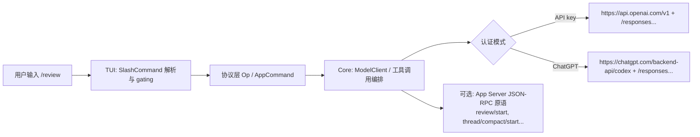

# Codex CLI 斜杠命令是否存在对应的公开 API 或分发二进制的深度研究报告

## 执行摘要

截至 2026-03-30（America/Chicago），针对“Codex CLI 的斜杠命令（Slash Commands/斜杠命令）是否存在对应的公开 API 或分发二进制”这一问题，可以给出较为明确的结论：**分发二进制不仅存在，而且是官方主路径**；而**“斜杠命令本身”并没有被设计成一组可直接远程调用的独立 HTTP 公共 API**，它主要是本地客户端（TUI）解析后触发内部动作与协议调用。与此同时，**Codex 的“公开可用”接口更像是两层：**（1）面向模型提供方的 OpenAI 兼容 API（默认走 Responses API）；（2）面向“把 Codex 嵌入产品/脚本化控制”的 **Codex App Server（JSON‑RPC）与 Codex SDK**。很多斜杠命令对应的能力（例如 review、compact、model list、thread 管理）在 App Server 的方法集中能找到“等价的底层原语”。citeturn4search0turn6view0turn18view1turn17view0turn20view0turn20view1

从网络调用层面看，Codex CLI 在“API key 登录”与“ChatGPT 登录”两种模式下，默认基址不同：前者默认 `https://api.openai.com/v1`；后者默认 `https://chatgpt.com/backend-api/codex`。在此基础上，核心请求路径在代码中明确写为 `"/responses"`（即 `.../v1/responses` 或 `.../backend-api/codex/responses`），并存在 `"/responses/compact"` 与 `"/memories/trace_summarize"` 等路径；同时会带上一些与粘性路由/分流、子代理标识、实验特性相关的头（例如 `x-codex-turn-state`、`x-openai-subagent`、`OpenAI-Beta`）。这些都属于“斜杠命令触发的能力最终会走到的网络层”，但它们并不等价于“斜杠命令＝某个公开 HTTP endpoint”。citeturn20view1turn20view0turn19view0

## 研究范围与方法

本报告把“codex”按优先级分为三类候选：  
第一优先级：与 OpenAI 官方 Codex CLI/IDE/App 相关的“codex”项目与文档（OpenAI 开发者文档、官方开源仓库、官方发行渠道）。citeturn16search2turn16search5turn4search0turn6view0turn14view0  
第二优先级：操作系统或主流包管理渠道的分发元数据（Homebrew cask、npm 包页、WinGet/winget 清单）。citeturn16search0turn16search3turn16search1  
第三优先级：社区/第三方技术分析与排障经验（仅用于补充“怎么复现/怎么抓包/怎么开日志”，不作为唯一证据）。citeturn5search25turn3search18turn5search0  

在“是否有对应公开 API”方面，本报告把“公开 API”拆成两种含义分别判断：  
A. **把 `/review`、`/compact` 之类当作远程服务的‘命令 API’**（例如 `POST /slash/review`）。  
B. **可编程控制 Codex 的公开接口**（例如本地 app-server JSON‑RPC、官方 SDK）。citeturn18view1turn17view0  

## 权威信息源清单与检查顺序

这一部分按“最权威→次权威”列出你应该优先核查的渠道，用于确认“是否存在公开 API/分发二进制/命令实现在哪”。

首先核查：官方文档与官方开源仓库
1) OpenAI 开发者文档：Codex CLI（安装、特性、Slash commands、认证、App Server、SDK）  
- Codex CLI 概览与安装入口（明确“本地运行”“开源”“Rust 实现”）。citeturn16search2  
- Slash commands 文档（列出命令集与行为，属于“命令层规范”）。citeturn19view3turn1view4  
- Authentication（明确 ChatGPT 登录与 API key 登录、凭据缓存位置、CA 证书环境变量等）。citeturn19view0  
- App Server（明确 JSON‑RPC 协议、`review/start`、`thread/compact/start`、`model/list` 等方法，属于“可编程接口层”）。citeturn18view1  
- Codex SDK（公开 TypeScript SDK，用于程序化控制 thread/turn）。citeturn17view0  

2) 官方开源仓库：openai/codex  
- 根 README：明确安装方式（npm、brew、GitHub Release 下载二进制）并列出典型 release 产物命名（macOS/Linux tar.gz）。citeturn4search0  
- codex-rs（Rust 实现）目录 README：强调“standalone/native executable”“零依赖安装”的设计目标，并指出 TUI/exec/cli 等模块组织。citeturn6view0  

第二步核查：官方/半官方分发渠道与工件
3) GitHub Releases（官方 release notes 与 tag/commit）  
- 最新 release 页面能看到版本、tag、提交短 hash（示例：`rust-v0.117.0`，`4c70bff`）与变更摘要，属于权威“发布时间线/版本锚点”。citeturn14view0turn15view2  
- 注意：GitHub 页面“Assets”列表在部分环境会动态加载失败；但根 README 已给出典型资产命名，足以作为“存在分发二进制”的证据链补强。citeturn4search0turn15view2  

4) Homebrew cask（macOS 分发元数据）  
- `brew install --cask codex`，并显示当前版本号（示例：0.117.0）与上游仓库链接。citeturn16search0  

5) npm 包：`@openai/codex`（跨平台安装入口之一）  
- npm 包页与官方 README 一致指向“本地运行”的 Codex CLI。citeturn16search3turn4search0  

6) WinGet（Windows 分发）  
- 第三方索引站点显示 `winget install -e --id OpenAI.Codex` 与版本信息，可作为“Windows 侧分发存在”的旁证；更严谨的做法是进一步查看 winget 清单仓库，但本报告以“存在分发”层面就足够。citeturn16search1turn16search32  

第三步核查：实现细节（源码级证据）
7) 斜杠命令枚举与描述（TUI 层）  
- `codex-rs/tui/src/slash_command.rs`：内置命令枚举 `SlashCommand`、命令名序列化、描述文案、是否支持 inline args、任务执行期间是否可用。citeturn9view0  
- `codex-rs/tui/src/bottom_pane/slash_commands.rs`：内置命令可见性/特性开关 gating、fuzzy match、按 flags 过滤等。citeturn12view0  
- `docs/tui-chat-composer.md`：解释 ChatComposer 如何识别 slash command、以及 `/plan`、`/review` 这类“带参数 slash”复用同一准备/提交路径。citeturn11view0turn12view2  

8) 模型提供方与网络端点（核心层）  
- `codex-rs/core/src/model_provider_info.rs`：默认 base_url 选择逻辑（ChatGPT 登录 vs API key）、wire_api 固定为 Responses、并提到“Responses API exposed at `/v1/responses`”。同时定义了 env_key、额外 headers、以及 `experimental_bearer_token` 等。citeturn20view0  
- `codex-rs/core/src/client.rs`：明确 `RESPONSES_ENDPOINT="/responses"`、`RESPONSES_COMPACT_ENDPOINT="/responses/compact"`、`MEMORIES_SUMMARIZE_ENDPOINT="/memories/trace_summarize"`，以及与 `OpenAI-Beta`、`x-codex-turn-state`、`x-openai-subagent` 等头相关的常量/逻辑。citeturn20view1  

## 斜杠命令是否对应“公开 API”与“分发二进制”的结论

### 分发二进制结论

**存在官方分发二进制，而且是主要交付形态之一。**证据链是“官方仓库 README + Rust 实现的定位 + 包管理渠道元数据 + release tag/commit”。  
- 根 README 明确写出通过 npm/Homebrew 安装，并说明可从 GitHub Release 下载平台特定二进制归档（列举了 macOS arm64、x86_64 以及 Linux musl 归档名样式）。citeturn4search0  
- codex-rs README 明确 Rust CLI 是“standalone、native executable”，并可通过 npm、brew cask 或 GitHub Releases 安装。citeturn6view0  
- Homebrew cask 页面给出 codex cask、安装命令与当前版本。citeturn16search0  
- 最新 release 页展示 tag（`rust-v0.117.0`）与 commit short hash（`4c70bff`），锚定为“确实在持续发布”。citeturn14view0turn15view2  

因此，“有没有分发二进制”这个问题答案是：**有。**

### 斜杠命令是否对应“公开 API”的结论

这里分两层回答，避免概念混淆：

**结论 1：不存在“斜杠命令＝某个公开 HTTP endpoint”这种一对一的公开 API 设计。**  
你在 TUI 中输入 `/review`，首先触发的是本地输入解析与命令分发（见 `SlashCommand` 枚举与 ChatComposer/命令 popup 的描述）。这些命令很多是“本地 UI 控制/切换/查看状态”，并不天然需要一个远程 API。citeturn9view0turn11view0turn12view0  

**结论 2：存在“可编程地控制 Codex（包含 review/compact 等能力）”的公开接口，但它们的形态是 App Server（JSON‑RPC）与 Codex SDK，而不是把 slash commands 暴露成 HTTP 命令 API。**  
- App Server 文档明确 Codex app-server 使用 JSON‑RPC 2.0（stdio JSONL 或 WebSocket），并在 API overview 中提供 `review/start`、`thread/compact/start`、`model/list` 等方法名，这些与 `/review`、`/compact`、`/model` 在语义上高度对应，属于“底层原语公开”。citeturn18view1  
- Codex SDK 文档明确可通过 `@openai/codex-sdk` 以编程方式 start/resume thread，并 `thread.run()` 推动回合执行，这是一条“把 Codex 当作可嵌入组件”的公开路径。citeturn17view0  

换句话说：**如果你要的是“公开 API 能力”，重点不在 slash commands，而在 app-server 与 SDK。**slash command 更多是“用户交互入口”。

## 斜杠命令触发的网络端点证据与请求样例

这一节把“slash → 最终会打到哪些网络端点”拆成两种运行模式，并尽量给出可复现的请求外形。注意：这里的样例以“端点与鉴权形态”为主；具体 payload 字段会随 Codex 版本、模型、工具集与是否走 WebSocket 而变化。

### 端点与基址的源码级证据

`ModelProviderInfo::to_api_provider` 的默认 base_url 选择逻辑非常关键：  
- 当认证模式是 ChatGPT（`AuthMode::Chatgpt`）时，默认 base_url 是 `https://chatgpt.com/backend-api/codex`；否则（例如 API key）默认 base_url 是 `https://api.openai.com/v1`。citeturn20view0  
同时，wire API 被限制为 Responses（并提示 Responses API 在 `/v1/responses`）。citeturn20view0  

在核心客户端中，端点路径常量明确：  
- `RESPONSES_ENDPOINT = "/responses"`  
- `RESPONSES_COMPACT_ENDPOINT = "/responses/compact"`  
- `MEMORIES_SUMMARIZE_ENDPOINT = "/memories/trace_summarize"`citeturn20view1  

据此可以推导出**两套默认请求 URL 形态**（推导属于基于源码常量的直接拼接，不是猜测）：

- API key 登录：  
  - `https://api.openai.com/v1/responses`  
  - `https://api.openai.com/v1/responses/compact`  
  - `https://api.openai.com/v1/memories/trace_summarize`citeturn20view1turn20view0  

- ChatGPT 登录：  
  - `https://chatgpt.com/backend-api/codex/responses`  
  - `https://chatgpt.com/backend-api/codex/responses/compact`  
  - `https://chatgpt.com/backend-api/codex/memories/trace_summarize`citeturn20view1turn20view0  

### 鉴权方式与关键 Header 的证据

鉴权方面，官方文档确认两种登录方式：ChatGPT 登录（浏览器 OAuth 回传访问令牌）与 API key 登录，并强调凭据缓存于 `~/.codex/auth.json` 或系统凭据库，且文件模式下应视为密码。citeturn19view0  

`model_provider_info.rs` 提供了更“工程化”的鉴权线索：  
- provider 配置包含 `env_key`（API key 环境变量名）、以及不推荐但存在的 `experimental_bearer_token`（用于 `Authorization: Bearer <token>`）。citeturn20view0  
- 默认 openai provider 会从环境变量注入 `OpenAI-Organization` 与 `OpenAI-Project` 头（如果设置了 `OPENAI_ORGANIZATION` / `OPENAI_PROJECT`）。citeturn20view0  

`client.rs` 则体现了运行时会出现的“行为相关 header”：  
- `OpenAI-Beta`（并给出了 `responses_websockets=2026-02-06` 这一 beta header value，用于 Responses WebSocket transport）。citeturn20view1  
- `x-codex-turn-state`（用于 sticky routing，要求同一 turn 内回放）。citeturn20view1  
- `x-codex-turn-metadata`（元数据）。citeturn20view1  
- `x-openai-subagent`（当 session 来源是 SubAgent 时写入；代码里明确出现 `review`、`compact`、`memory_consolidation` 等标签）。这意味着 `/review`、`/compact` 很可能在请求链路上具备“子代理”标识。citeturn20view1  

### 与具体斜杠命令的对应关系

这里用“最可证据化”的对应做映射（避免把“UI 命令”强行解释成“网络 API”）：

- `/compact`：从命令描述与核心客户端实现可以推断它会触发“对话压缩/整理”能力；核心客户端存在 `"/responses/compact"` 的一元调用实现，并用于“compact conversation history”。citeturn9view0turn20view1  

- `/review`：命令枚举里有 `Review`，描述为“review my current changes”；同时核心客户端会在 SubAgentSource::Review 情况下注入 `x-openai-subagent: review` 头，这与“review 是一个子代理/子流程”相吻合。citeturn9view0turn20view1  
  另一个角度：App Server 的 API overview 明确存在 `review/start` 方法（“kick off the Codex reviewer for a thread”），这是“review 工作流”在可编程接口层的公开原语。citeturn18view1  

- `/model`：命令描述是“choose what model and reasoning effort to use”；App Server API overview 明确存在 `model/list` 方法，并支持 effort/options 等。citeturn9view0turn18view1  

- `/new`、`/resume`、`/fork`、`/rename` 等 thread 管理类：App Server API overview 提供 `thread/start`、`thread/resume`、`thread/fork`、`thread/name/set` 等方法，可以视为“斜杠命令背后的底层 API”。citeturn9view0turn18view1  

### 可复现请求样例

下面给出两组“你可以自己抓包验证”的样例。它们不是从单一网页逐字复制，而是依据上述“默认 base_url + endpoint 常量 + 鉴权形态”组合出来的最小可用骨架；真正字段请以你运行时抓到的请求为准。

1) API key 模式下的 Responses 调用骨架（用于验证 `/review`、普通对话、或 `/compact` 一类会触发模型请求的行为）

```bash
export OPENAI_API_KEY="sk-..."
# 可选：组织/项目头（若你在组织/项目体系下）
export OPENAI_ORGANIZATION="org_..."
export OPENAI_PROJECT="proj_..."

# 最小化的“响应生成”骨架（注意：Codex 可能用 WebSocket 或 SSE；这里用 HTTP 只为示意）
curl -sS -X POST "https://api.openai.com/v1/responses" \
  -H "Authorization: Bearer $OPENAI_API_KEY" \
  -H "Content-Type: application/json" \
  -d '{
    "model": "gpt-5.4",
    "input": [{"role":"user","content":"ping"}]
  }'
```

上述 URL 与端点存在于 Codex 源码默认值与常量中（base_url `https://api.openai.com/v1` + `"/responses"`）。citeturn20view0turn20view1  

2) ChatGPT 登录模式下的基址验证（你更可能看到的是 `chatgpt.com/backend-api/codex/...`）

```bash
# 关键点不是“直接 curl”，而是你抓包时应看到的 host/path 形态：
# https://chatgpt.com/backend-api/codex/responses
# https://chatgpt.com/backend-api/codex/responses/compact
```

ChatGPT 模式的 base_url 由源码直接指定；官方认证文档也说明 ChatGPT 登录会把访问令牌回传给 CLI 并缓存，且会自动刷新。citeturn20view0turn19view0  

如果你希望把“/review 是否真的走 review 子流程”做成更强证据链，建议在抓包时同时关注请求头里是否出现 `x-openai-subagent: review`（代码中明确存在这一路径）。citeturn20view1turn9view0  

## 本地二进制与代码路径证据

### 斜杠命令在二进制中的“硬编码事实”

`codex-rs/tui/src/slash_command.rs` 把内置斜杠命令定义为枚举 `SlashCommand`，并声明“展示顺序就是枚举顺序（不要字母排序）”，还包含：  
- 命令集合（例如 Model、Approvals、Review、Compact、Diff、Status、Logout、Plugins 等）  
- `description()`：命令弹窗描述文案  
- `supports_inline_args()`：明确哪些命令支持 `/review ...`、`/plan ...` 等内联参数  
- `available_during_task()`：哪些命令可在任务运行时触发citeturn9view0  

这类实现意味着：**斜杠命令不是“服务器下发配置的动态菜单”，而是客户端二进制内置的命令集合（至少 built-in 是这样）。**

进一步，`codex-rs/tui/src/bottom_pane/slash_commands.rs` 把“哪些命令在当前输入/特性开关下可用”做了集中管理：  
- `BuiltinCommandFlags` 包括 connectors、plugins、fast、personality、realtime、allow_elevate_sandbox 等开关  
- `builtins_for_input()` 负责按 flags 过滤命令  
- `find_builtin_command()` 用于找到可分发的内置命令  
- `has_builtin_prefix()` 做 fuzzy match（解释了为何输入 `/ac` 之类会影响候选）citeturn12view0  

因此，“slash commands 是否有对应分发二进制”的答案在实现层面也很清晰：**slash commands 就包含在 codex 可执行文件里**，不存在“另一个专门处理 slash commands 的独立分发二进制”的必要性（至少对 built-in 命令如此）。

### 如何在仓库或安装包中定位实现

如果你想把“某个 slash 命令到底做了什么”追到更深层（例如 `/review` 如何收集 git diff、如何启动 review 流程），建议按下面路径定位：

1) UI 输入解析与命令识别  
- `codex-rs/tui/src/bottom_pane/chat_composer.rs`：输入 state machine，说明 slash command、`/plan` 与 `/review` 这类“带参数 slash”会复用准备/提交流程。citeturn12view2turn11view0  

2) Slash 命令集合与 gating  
- `codex-rs/tui/src/slash_command.rs` 与 `codex-rs/tui/src/bottom_pane/slash_commands.rs`（见上）。citeturn9view0turn12view0  

3) 命令分发到“核心协议操作（Op）”  
- `codex-rs/tui/src/app_command.rs` 把 UI 层动作包装成 `Op`（例如 `Op::Review{...}`、`Op::Compact`、`Op::ThreadRollback` 等），这是“slash → 协议层”的关键分界点。citeturn13view0  

4) 核心网络调用  
- `codex-rs/core/src/model_provider_info.rs`（基址/headers/鉴权形态）。citeturn20view0  
- `codex-rs/core/src/client.rs`（Responses endpoints、WebSocket beta header、subagent header 等）。citeturn20view1  

如果你是在本机已安装的二进制中定位：  
- npm 安装：通常会把平台二进制放在 npm 包的某个子目录并在 `codex` shim 中调用（Rust 版以“native executable”为目标，但 npm 仍可作为分发载体）。官方 README 明确 npm 是安装方式之一。citeturn4search0turn6view0  
- Homebrew/WinGet 安装：直接落二进制（WinGet 甚至出现“目标三元组后缀的 exe 文件名”这一类包装问题，说明确实是二进制资产被分发）。citeturn16search0turn16search32  

## 复现网络调用与拦截/追踪方法

### 直接观测：打开 Codex 自身日志

一条非常现实的路径是先让 Codex 自己把 HTTP 客户端日志打出来：  
- 社区中文资料给出 `RUST_LOG=codex_core=trace,reqwest=trace codex` 并查看 `~/.codex/log/codex-tui.log` 的做法；这与 Codex 使用 Rust/reqwest 的实现栈一致，可作为快速排障手段。citeturn5search25turn16search2  

示例：

```bash
export RUST_LOG="codex_core=trace,reqwest=trace"
codex 2>&1 | tee /tmp/codex.log
```

你要重点搜索的关键词：  
- `api.openai.com` 或 `chatgpt.com/backend-api/codex`（基址差异）citeturn20view0  
- `/responses`、`/responses/compact`、`/memories/trace_summarize`（端点）citeturn20view1  
- `OpenAI-Beta`、`x-codex-turn-state`、`x-openai-subagent`（头信息）citeturn20view1  

### TLS 拦截：mitmproxy/企业代理环境

官方认证文档提供了**自定义 CA bundle**的环境变量：`CODEX_CA_CERTIFICATE`（否则回落到 `SSL_CERT_FILE`），并声明该 CA 设置适用于登录与正常 HTTPS 请求以及安全 websocket 连接。citeturn19view0  

这意味着你可以用 mitmproxy 生成自签根证书后：  
1) 把 mitmproxy 根证书导出为 PEM；  
2) `export CODEX_CA_CERTIFICATE=/path/to/mitmproxy-ca.pem`；  
3) 让 Codex 信任你的代理证书链，再进行 TLS 解密抓包。citeturn19view0  

注意：这一步的安全含义很直接——你在主动“中间人解密”自己的会话流量，务必在隔离环境进行。

### 系统层拦截：tcpdump/strace

即使你不做 TLS 解密，也能通过系统工具确定“连到哪里”：  

- `tcpdump`（域名解析后你会看到目标 IP，但 SNI/证书信息需要额外工具）：  
```bash
sudo tcpdump -i any -nn 'tcp port 443'
```

- `strace`/`dtruss`（看 connect()/sendto()，定位远端 host:port；Linux 上也能看是否启动了本地 websocket/stdio app-server 子进程）：  
```bash
strace -f -e trace=network,process -s 256 codex
```

这些属于通用方法，本报告给出的是“可执行操作步骤”，但更强的“端点/头字段”证据仍应来自 Codex 自身日志或 TLS 解密流量。

### 复现“斜杠命令引发网络请求”的最小流程

建议用最简单的 3 步复现链来验证：  
1) 启动 Codex（确保已登录，或用 API key 模式）。citeturn19view0turn4search0  
2) 在 TUI 输入 `/compact` 或 `/review`（它们最可能触发模型侧调用而不是纯 UI 切换）。citeturn9view0turn20view1  
3) 同时打开 `RUST_LOG=codex_core=trace,reqwest=trace`，观察请求 URL 与 header。citeturn5search25turn20view1  

如果你希望用“公开 API 层”复现 `/review` 的等价动作，可以直接用 app-server：它文档给出了 stdio JSON‑RPC 的交互方式，并且 API overview 明确存在 `review/start`。citeturn18view1  

## 安全与鉴权影响分析

### 凭据与存储风险

官方明确：Codex 会缓存登录信息；文件模式下缓存于 `~/.codex/auth.json`（明文），并强调应当像密码一样保护，不能提交/粘贴/分享。citeturn19view0  

这对你的安全模型意味着：  
- 如果机器被入侵，攻击者拿到 `auth.json` 可能获得可用访问令牌（尤其是 ChatGPT 登录时的 access token；文档也提到会自动刷新）。citeturn19view0  
- 团队环境建议启用 keyring 存储（`cli_auth_credentials_store="keyring"`），并通过“managed configuration”强制登录方式/工作区绑定。citeturn19view0  

### Token/Scope 与“ChatGPT 登录 vs API key”的治理差异

官方文档明确两种登录方式会落在不同的治理与数据处理策略下：  
- ChatGPT 登录跟随 ChatGPT workspace 权限、RBAC、保留与驻留设置；  
- API key 登录则跟随 API 组织的保留与数据共享设置。citeturn19view0  

这在安全审计上很关键：**同样是 “/review”，你选择哪种登录方式会改变合规边界。**

### 可能泄露的元数据与遥测

从源码看，Codex 请求中存在多种“元信息头”：  
- `x-codex-turn-state`（粘性路由）；  
- `x-codex-turn-metadata`（元数据）；  
- `x-openai-subagent`（review/compact 等子代理标识）；  
- `OpenAI-Beta`（启用某些 beta transport/特性）。citeturn20view1  

此外，provider 逻辑默认还会注入版本号与可选的组织/项目头（`OpenAI-Organization`、`OpenAI-Project`），这些都会成为你请求的可观测维度。citeturn20view0  

如果你在企业环境中做流量出口控制或日志脱敏，建议把这些字段纳入“敏感信息/可关联信息”清单。

## 来源与结论置信度对照表

| 关键主张 | 主要证据来源（优先列官方/源码） | 置信度 | 理由 |
|---|---|---:|---|
| Codex CLI 有官方分发二进制（且持续发布） | 官方仓库 README（提到 GitHub Release 二进制资产命名）、codex-rs README（standalone/native）、GitHub release tag/commit、Homebrew cask | 高 | 多个独立官方渠道一致证明；版本号与 release tag 可互相校验。citeturn4search0turn6view0turn14view0turn16search0 |
| 内置 Slash Commands 是客户端二进制内置命令集合 | `codex-rs/tui/src/slash_command.rs`（枚举+描述）、`bottom_pane/slash_commands.rs`（gating/filtering） | 高 | 枚举硬编码、过滤逻辑完备，直接说明实现位置。citeturn9view0turn12view0 |
| Slash Commands 并非被公开为“可远程调用的 HTTP 命令 API” | Slash 命令实现位于 TUI 层；公开的“可编程接口”在 app-server/SDK，而不是“slash endpoint” | 中高 | 证据指向“公开接口形态是 app-server/SDK”；但“没有任何 slash HTTP API”属于否定性命题，只能做到“未见官方定义且实现上不需要”。citeturn18view1turn17view0turn9view0 |
| 存在公开可编程接口与 slash 能力部分对齐（review/compact/model/thread） | App Server 文档（`review/start`、`thread/compact/start`、`model/list` 等）、Codex SDK 文档（thread.run） | 高 | 官方文档直接列出方法名与协议，属于公开接口。citeturn18view1turn17view0 |
| Codex 默认请求基址随登录方式变化：API key→`api.openai.com/v1`，ChatGPT→`chatgpt.com/backend-api/codex` | `model_provider_info.rs` 的默认 base_url 逻辑；Authentication 文档对 ChatGPT 登录与 token 缓存说明 | 高 | 源码+官方文档闭环。citeturn20view0turn19view0 |
| 核心模型请求端点包含 `/responses`，并存在 `/responses/compact` 与 `/memories/trace_summarize` | `client.rs` 常量定义与实现注释 | 高 | 端点常量在源码中明确。citeturn20view1 |
| `/review` 与子代理标识存在关联（可能出现 `x-openai-subagent: review`） | `client.rs`：SubAgentSource::Review → `x-openai-subagent`；SlashCommand::Review 存在 | 中高 | 代码路径明确存在，但“具体哪一次请求一定带该头”需你本地抓包确认（会受执行路径影响）。citeturn20view1turn9view0 |
| 凭据缓存位置与风险（`~/.codex/auth.json` 明文或 keyring） | Authentication 文档 | 高 | 官方直接声明并给出配置项。citeturn19view0 |
| 详尽 debug 日志与排障命令（RUST_LOG/日志文件） | 第三方中文经验（wener.me）+ Codex “Rust/本地 CLI”官方描述 | 中 | 属于实操经验，可信但非官方；建议用官方提供的 CA/日志思路交叉验证。citeturn5search25turn16search2 |

## 推荐的下一步行动与可复现命令

### 快速判断“你用的 Codex 是否走公开 API（api.openai.com）还是 ChatGPT 后端（chatgpt.com）”

1) 打开最高粒度日志并启动 Codex：  
```bash
export RUST_LOG="codex_core=trace,reqwest=trace"
codex 2>&1 | tee /tmp/codex-trace.log
```
2) 在 TUI 中执行一次 `/review` 或 `/compact`。citeturn9view0turn20view1  
3) 搜索日志：  
```bash
grep -E "api\.openai\.com|chatgpt\.com/backend-api/codex|/responses|/responses/compact" /tmp/codex-trace.log
```
你应能看到 base_url 与 endpoint 组合（从源码看这两者就是关键分界）。citeturn20view0turn20view1  

### 验证“slash 命令是否有等价的公开可编程调用”

用 app-server 走一遍“review 原语”而不是 slash：  
- 官方文档给出 JSON‑RPC/stdio 的消息形态与方法名（thread/start、turn/start、review/start）。citeturn18view1  
你可以按文档示例启动 `codex app-server`，然后发送最小 JSON‑RPC 消息序列，确认 `review/start` 的行为与 `/review` 是否一致/接近。

### 对“/responses/compact 与 /memories/trace_summarize 是否属于公开 OpenAI API”做最终裁决

本报告能做到的证据是：**这些路径在 Codex 开源客户端中存在且被调用**。citeturn20view1  
但“是否属于 OpenAI 平台面向所有 API 用户的公共文档 endpoint”这一点，需要你进一步核查 OpenAI API Reference（而不是 Codex 文档）是否出现对应端点与参数定义。实践步骤：  
- 在 OpenAI API Reference 中全文搜索 `responses/compact` 与 `trace_summarize`；  
- 如果 API Reference 没有，但 Codex 仍调用，通常意味着它是**Codex 产品侧或 ChatGPT 后端侧的专用接口**（对外稳定性与 SLA 可能不同于公开 API）。

### 供应链与权限侧的硬建议

- 如果你在企业/受控环境部署，优先用 keyring 存储凭据，并用 managed configuration 强制登录方式；避免在共享/CI 日志中泄露 `auth.json`。citeturn19view0  
- 若必须做 TLS 代理/抓包，使用 `CODEX_CA_CERTIFICATE` 指定企业 CA 或 mitm CA，并把抓包环境隔离，避免令牌泄露。citeturn19view0  
- 如果你需要把“/review 工作流”嵌入自动化，优先走 Codex SDK 或 app-server 的公开原语（`review/start`、`thread/compact/start`），而不是尝试“在远端模拟 slash 文本”。citeturn18view1turn17view0turn10search7  



上述架构图的关键节点均有源码/官方文档支撑：slash 命令枚举与 gating、app-server 方法名、base_url 选择与 `/responses` 常量。citeturn9view0turn12view0turn18view1turn20view0turn20view1